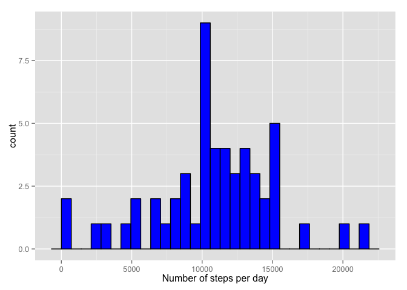
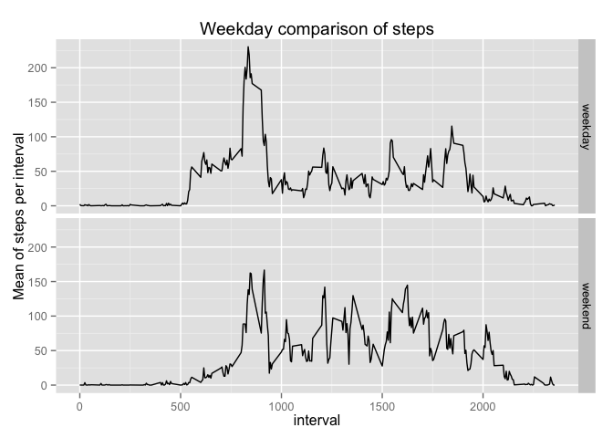

# PEER ASSESSMENT 1. REPRODUCIBLE RESEARCH

It is now possible to collect a large amount of data about personal movement using activity monitoring devices such as a Fitbit, Nike Fuelband, or Jawbone Up. These type of devices are part of the "quantified self" movement -- a group of enthusiasts who take measurements about themselves regularly to improve their health, to find patterns in their behavior, or because they are tech geeks. But these data remain under-utilized both because the raw data are hard to obtain and there is a lack of statistical methods and software for processing and interpreting the data.

This assignment makes use of data from a personal activity monitoring device. This device collects data at 5 minute intervals through out the day. The data consists of two months of data from an anonymous individual collected during the months of October and November, 2012 and include the number of steps taken in 5 minute intervals each day.

***
## Data
The data for this assignment can be downloaded from the course web site and then imported in to R

## Loading and preprocessing the data

We first read the date, once in the working directory

```r
activity <- read.csv("./activity.csv")
```
We can then transform the date column into an actual date format by

```r
activity$date<- as.Date(activity$date, "%Y-%m-%d")
```

## What is mean total number of steps taken per day?

We sum steps for each day


```r
ac_steps<-summarise(group_by(activity, date), s=sum(steps))
qplot(ac_steps$s, geom="histogram", fill=I("blue"), col=I("black"), xlab = "Number of steps per day")
```

```
## stat_bin: binwidth defaulted to range/30. Use 'binwidth = x' to adjust this.
```



The mean and meadian of steps taken per day,

```r
mean(ac_steps$s, na.rm = TRUE)
```

```
## [1] 10766.19
```

```r
median(ac_steps$s, na.rm = TRUE)
```

```
## [1] 10765
```
***
## What is the average daily activity pattern?

To make a time series plot (i.e. type = "l") of the 5-minute interval (x-axis) and the average number of steps taken, averaged across all days (y-axis)

```r
ac_5min<-summarise(group_by(activity, interval), s=sum(steps, na.rm = TRUE))
qplot(ac_5min$interval, ac_5min$s, geom="line", xlab = "5 min intervals", ylab="Number of steps / interval", main = "Steps by 5-min intervals")
```


To figure out which 5-minute interval, on average across all the days in the dataset, contains the maximum number of steps, we can run the following code:

```r
ac_5min[which.max(ac_5min$s),]
```

```
## Source: local data frame [1 x 2]
## 
##   interval     s
##      (int) (int)
## 1      835 10927
```
***
## Imputing missing values

Calculate and report the total number of missing values in the dataset (i.e. the total number of rows with NAs):

```r
sum(is.na(activity$steps))
```

```
## [1] 2304
```

In order to fill all of the missing values in the datasetwe will use the mean use for that  5-minute interval across all dates

```r
activity2 <- activity
for (i in 1:length(activity2$steps)){
    if (is.na(activity2[i,1])){
        activity2[i,1] <- mean (activity2$steps[activity2$interval==activity2[i,3]], na.rm=TRUE)
    }
}
```

We can make a histogram of the total number of steps taken each day and Calculate and report the mean and median total number of steps taken per day.

```r
ac_steps<-summarise(group_by(activity2, date), s=sum(steps))
qplot(ac_steps$s, geom="histogram", fill=I("blue"), col=I("black"), xlab = "Number of steps per day")
```

```
## stat_bin: binwidth defaulted to range/30. Use 'binwidth = x' to adjust this.
```


The new mean and meadian of steps taken per day can also be calculated

```r
mean(ac_steps$s, na.rm = TRUE)
```

```
## [1] 10766.19
```

```r
median(ac_steps$s, na.rm = TRUE)
```

```
## [1] 10766.19
```

As we expected, since we add the mean for each interval to the missing values, the total mean of steps taker per day does not change. 
***
## Are there differences in activity patterns between weekdays and weekends?

First, we need to create a new factor variable in the dataset with two levels -- "weekday" and "weekend" indicating whether a given date is a weekday or weekend day.


```r
activity2$weekday <- character(length( activity2$steps))
for (i in 1: length( activity2$steps)){
    day <- if (weekdays(activity2[i,2])=="Saturday"||weekdays(activity2[i,2])=="Sunday") "weekend" else "weekday"
    activity2[i,4] <- day
}
```

We can make a panel plot containing a time series plot (i.e. type = "l") of the 5-minute interval (x-axis) and the average number of steps taken, averaged across all weekday days or weekend days (y-axis)

```r
ac2_5min<-aggregate(steps ~ interval + weekday, activity2, mean)
ac2_5min$weekday <- as.factor(ac2_5min$weekday)
q <- ggplot(ac2_5min, aes(interval, steps))
q + geom_line() + facet_grid(weekday~.) + labs(y = "Mean of steps per interval", title ="Weekday comparison of steps")
```


